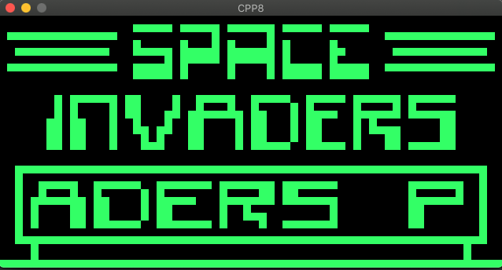

# cpp8

A Chip-8 emulator.

## Resources

- https://en.wikipedia.org/wiki/CHIP-8
- http://devernay.free.fr/hacks/chip8/C8TECH10.HTM
- https://github.com/nibblebits/Chip8InCCourse
- https://opengameart.org/content/512-sound-effects-8-bit-style
- https://itch.io/jam/octojam-6

## Usage

    make game=INVADERS run

## TODO
- scanline effect
- debug gui
- bugs in some roms

